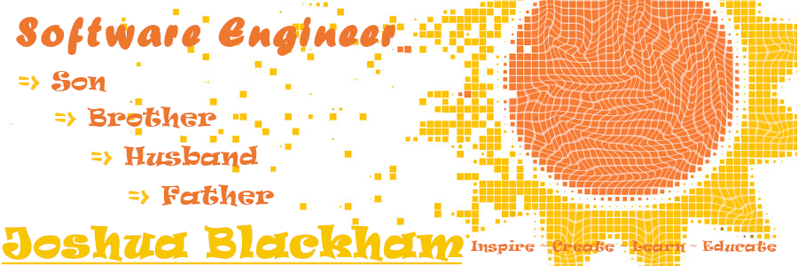

### I'm [Joshua Blackham](https://blackhamjoshua.tech)

- 🔭 I’m currently working on Darndest, 4Cast, and PrismRiot
- 🌱 I’m currently leaning into and learning [Python/Django](https://code.visualstudio.com/docs/python/tutorial-django), [Postgresql](https://www.postgresql.org/), [React Native](https://reactnative.dev/docs/getting-started), and [Vue.js](https://vuejs.org/)
- 🤔 I’m looking for help with finding my first dev job, and digging deeper into [Crypto and Blockchain](https://reactnative.dev/docs/getting-started)
- 💬 Ask me about JavaScript, TailwindCSS, Ruby on Rails, Relational & Non Relational Databases.
- 📫 How to reach me: [Portfolio Site](https://blackhamjoshua.tech) ~ [Email](mailto:blackhamjoshua@comcast.net) ~ [LinkedIn](https://www.linkedin.com/in/blackham~joshua/)
